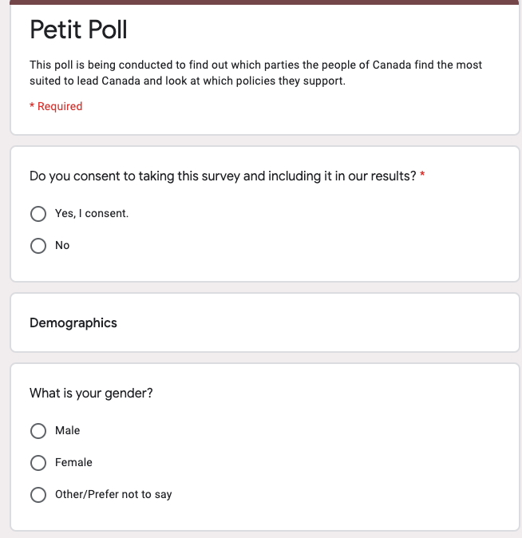

```{r, message=F, echo=F, warning=F}
#install.packages("tidyverse")
library(tidyverse)
#devtools::install_github("hodgettsp/cesR")
library(cesR)
#install.packages("cowplot")
library(cowplot)
#install.packages("knitr")
library(knitr)
```


```{r, results='hide', echo=F, warning=F, message=FALSE}
#get CES dataset, in order to find proportions for certain questions, ie demographics and voting habits

get_ces("ces2019_web")
ces2019_web <- labelled::to_factor(ces2019_web)

#create a new variable in CES to group voters, by age range
ces2019_web <- ces2019_web %>%
  mutate(age_range = ifelse(cps19_age < 30, "18-29", 
                            ifelse(cps19_age < 40, "30-39",
                                   ifelse(cps19_age < 50, "40-49",
                                          ifelse(cps19_age < 60, "50-59",
                                                 ifelse(cps19_age < 70, "60-69", "70+"))))))

#these proportions are from Angus Reid as to who the people of Canada would vote for if an election was held this month. In order of Liberal, Conservative, NDP, Bloc Quebecois, Green, PPC and other

next_vote_prop <- c(.37, .31, .17, .07, .05, .02, .01)

#from CES, finding proportions for each age group

age_props <- ces2019_web %>% 
  group_by(age_range) %>% 
  summarise(n = n()) %>% 
  mutate(prop = n/sum(n))

#find proportions for gender, dropping entries that were empty from CES
gender_props <- ces2019_web %>% drop_na(cps19_gender) %>% 
  group_by(cps19_gender) %>% 
  summarise(n = n()) %>% 
  mutate(prop = n/sum(n))

# add proportions for Trudeau approval rating, Angus Reid

trudeau_approval_props = c(.45, .52, .03)

#find proportions for last vote, data is from CES 2019 -> last election
last_vote_props <- ces2019_web %>% 
  drop_na(cps19_votechoice) %>% 
  group_by(cps19_votechoice) %>% 
  summarise(n = n()) %>% 
  mutate(prop = n/sum(n))

last_vote_props <- 
  last_vote_props %>% 
  #take out other category, it will be replaced by Don't Know for our survey
  filter(cps19_votechoice != "Another party (please specify)")

#get props for provinces from CES
province_props <- ces2019_web %>% 
  group_by(cps19_province) %>% 
  summarise(n = n()) %>% 
  mutate(prop = n/sum(n))


#find level of education proportions from CES
level_of_education <- ces2019_web %>% 
  drop_na(cps19_education) %>% 
  group_by(cps19_education) %>% 
  summarise(n = n()) %>% 
  mutate(prop = n/sum(n))

#covid vaccine proportions from Angus Reid
covid_prop <- c(.78, .14, .08)

#important issue proportions from Angus Reid
imp_issue_prop <- c(.32, .29, .28, .11)
```


# Non-Technical Summary

The Liberal Party of Canada has experienced success over the last few elections and they wanted to see where they stand after the most recent throne speech last month and determine where their values should be to gain support. In order to find these results, Petit Polling decided to run random simulations to get an idea of what the people of Canada are thinking right now. We used real-life data and some random data to achieve our findings and combined them with a random list of 2400 Canadian voters. After the research was conducted, we found that the Liberals have lots of support from Canadians right now, controlling 38% of support from simulated respondents and found that healthcare is the most important topic on people's minds as of right now. These results are significant because it gives the Liberal Party proof that the plan they're following right now is working, Justin Trudeau's support has slipped but overall, people want to stay with the Liberal Party. We also took a look at the numbers from Alberta and found that many Albertans plan to vote Liberal, which is a massive discovery considering they usually vote Conservative. Some weaknesses we encountered were that some responses were incorrect, such as the Bloc Quebecois getting votes outside of Quebec or some under polling from people of different levels of education, leading to some inaccuracies. Finally, some next steps we can take are continuing to poll people with potentially different questions or different ways of reaching them, in order to get a clear picture of Canadian voters.

# Introduction

In this report, I will summarize the results found from a simulated poll run for the Liberal Party of Canada. In this simulation, 2400 respondents' responses were simulated on a range of 15 questions, ranging from demographics to questions about parties and policies. The simulations were done using proportions from the 2019 CES online survey, Angus Reid polling data and random sampling. The results were then compiled into a dataset and two other columns were added, one representing the topic each respondent said to be the most important to them and another determining if their last election choice was the same as their current support. This report will focus on the repondent's choice of party if an election was held today, their level of education, whether they support Justin Trudeau as Prime Minister, their level of education, the topic they find most important (healthcare, economy, environment or immigration) and finally, we focused on the people in Alberta's responses because it is usually a conservative hotspot. The purpose of this study is to show the Liberal government where they line up compared to other parties (mainly the Conservatives) and how they can improve their chances of winning another election.

The main method of investigation for this report was trying to find where the Liberals can gain votes and see where and who they are losing them to. This was achieved by plotting different tables and graphs which focused on the distribution of parties being voted for and what was valued the most by Canadians. There are 6 graphs and one table labelled in Figures 1-7. Figures 1 and 2 focus on the same thing, where respondents plan to vote if an election was held today, and we find similar results to the last election, with support going to mainly the Liberals, then Conservative and finally the NDP and other parties. Figure 3 takes a look at where respondents of different levels of education plan to vote, giving us an idea of where the Liberal party should focus their advertising. The next two figures focus on respondents who don't plan to vote Liberal again and non-Liberal voters in general. Lastly, we took a look at the province of Alberta, a province that is usually dominated by the Conservative party and find that for the first time in a long time, the Liberals have most of the support. These results are important for our work because we find that the Liberal party has overwhelming support and should probably keep doing what they're doing.

Overall, the results obtained are significant because it shows that the Liberal party is experiencing lots of support from our sample of respondents. Our graphs and table allow us to demonstrate not only how the Liberals fare against the other parties, but also where the party can focus on improving their policies to gain even more support than they're already experiencing. Although our data does give some promising results, we still have to address weaknesses with the simulations and some next steps we can take after. When looking at our weaknesses, we have three main weaknesses that will be explained later, but in short, they include the matter of Bloc Quebecois getting support in provinces outside of Quebec when they don't have members there, our simulation weightings could be more accurate or changed to give different representations and have our survey be distributed evenly so we can an accurate view of what Canada thinks. When looking at our next steps, different surveys and survey sampling methods could be used such as a different set of questions that accurately reflect what happens in the next month and perhaps using a type of survey like stratified sampling where we can determine the desired proportions of who we want to hear from the most.

# Survey Methodology

For the survey, the desired population of interest are citizens of Canada. The desired frame is people on the registered voter's list for Canada and the sample will be people who respond to the invitation to take the survey and people who are randomly selected from the list.

For this survey, we plan to use simple random sampling without replacement, some good properties of this type of sampling are that mean of the sample, is an unbiased estimator for the population, meaning it is a fairly accurate estimator of what the true population value. This type of sampling is also strong because it is simple to conduct. It being simple is beneficial not only for finding candidates but also for costs because we don’t have to filter out further people with more survey questions. The survey will also incorporate a type of voluntary-response survey because we need people to willingly respond to get our data, but since we are taking random people from a list of voters, I believe our survey won't be subject to the standard characteristics of voluntary-response surveys.

To reach our respondents, we plan to utilize the registered voter's list that the party has access to. From this list, we will select a list of people and will get the campaign workers to contact them to see if they want to participate. The ideal sample size for this survey would be about 2400 people, as we can use this with a 95% confidence interval and a margin for error of +/- 2%.

To entice people to respond to the surveys, we plan to offer them a $10 gift card to a select list of stores, provided they give us their email to send them the survey and the gift card. Each person will receive a certain code that becomes active once they are registered. This should help keep responses honest because there is a monetary reward for the person's participation. This will cost roughly 25000 dollars if we get our desired number of respondents. This price estimate also includes the cost of campaign workers to reach the respondents.

To avoid non-response, we will offer to pay people to complete the survey. This may skew our results because younger people may be more eager to receive a monetary prize and may bring our age ranges down. Non-response will have an impact on our survey because we want to have the most data possible to get a clear picture of what Canadians think about the party. Since we are randomly sampling, it may not hurt us too much because we don’t focus on any particular age group.

This survey does not take any personal information, the only information required is an email to receive the survey and the first question asks if the person consents to the survey. This allows us to get the respondent's trust and make sure that everyone is on the same page as to what this survey is looking for. 


```{r, echo=F}
# save options for each question under q1 - q15

q1 <- c("Male", "Female", "Other")
q2 <- c("18-29", "30-39", "40-49", "50-59", "60-69", "70+")
q3 <- c("No Schooling", "Some Elementary School", "Elementary School", "Some high school","High School", "Some Community College", "Community College", "Some university", "Bachelor's Degree", "Master's Degree", "Doctorate", "Prefer not to answer")
q4 <- c("Alberta", "British Colombia", "Manitoba", "New Brunswick","Newfoundland and Labrador", "Northwest Territories",
        "Nova Scotia", "Nunavut", "Ontario", "Prince Edward Island", "Quebec", "Saskatchewan", "Yukon")
q5 <- c("Liberal", "Conservative", "NDP", "Bloc Quebecois", "Green", "PPC", "Other/Didn't Vote")
q6 <- c("Liberal", "Conservative", "NDP", "Bloc Quebecois", "Green", "PPC", "Other/Not Voting")
q7 <- c("Yes", "No", "Maybe")
q8 <- c(1:5)
q9 <- c(1:5)
q10 <- c(1:5)
q11 <- c(1:5)
q12 <- c("Yes", "No", "Maybe")
q13 <- c("Yes", "No", "Maybe")
q14 <- c("Yes", "No", "Unsure")
q15 <- c("Yes", "No", "Prefer not to say")
```


```{r, echo=F}
# save sample size under samp_size
samp_size <- 2400
set.seed(21)

#consent to the the survey, repeat it because their response wouldn't be included without it
consent <- rep("Yes, I consent.", samp_size)

# save gender using proportions from CES data
gender <- sample(q1, size = samp_size, replace = T, prob = gender_props$prop)

# save age using proportions from CES data
age <- sample(q2, size = samp_size, replace = T, prob = age_props$prop)

# save education data using proportions from CES data
education_level <- sample(q3, size = samp_size, replace = T, prob = level_of_education$prop)

# save province using proportions from CES data
province <- sample(q4, size = samp_size, replace = T, prob = province_props$prop)

# save last elections's voter habits using numbers from 
last_vote <- sample(q5, size = samp_size, replace = T, prob = last_vote_props$prop)

# next elections, from Angus Reid polling propotions
next_vote <- sample(q6, size = samp_size, replace = T, prob = next_vote_prop)

#Trudeau approval rating from Angus Reid polling data
trudeau_approval <- sample(q7, size = samp_size, replace = T, prob = trudeau_approval_props)

# next 6 are randomly selected, eventually maximum value will be determined
Health <- sample(q8, size = samp_size, replace = T)
Economy <- sample(q9, size = samp_size, replace = T)
Environment <- sample(q10, size = samp_size, replace = T)
Immigration <- sample(q11, size = samp_size, replace = T)
shutdown <- sample(q12, size = samp_size, replace = T)
right_direction <- sample(q13, size = samp_size, replace = T)

# simulate covid-19 responses using Angus reid data
covid_19 <- sample(q14, size = samp_size, replace = T, prob = covid_prop)

# randomly simulate employment question
employment <- sample(q15, size = samp_size, replace = T)

# save all results into dataset
results <- tibble(consent, gender, age, education_level, province, last_vote, next_vote,
                  trudeau_approval, Health, Economy, Environment, Immigration, shutdown,
                  right_direction, covid_19, employment
                  )

# create variable to show voter retention for liberals
results <- results %>% mutate(same_party = ifelse(last_vote == next_vote, "Yes", "No"))


# find column names of maxes
opinion_qs <- results %>% select(Health, Economy, Environment, Immigration)
most_important_value <- colnames(opinion_qs)[max.col(opinion_qs, ties.method = "first")]

# make a new column in results, this one consisting of the max value from 
# the ranking portion of the survey
results <- cbind(results, most_important_value)

```


# Results

In order to simulate responses and get an idea of what Canadians would say, a simulated dataset was created using the real-life data from Angus Reid polls and information from the CES responses. This dataset contains 2400 responses which were simulated using the "sample" function in R. The issues that occur with simulating based on simple random sampling is that we run the risk of under-covering groups. To avoid this bias as much as possible, some responses such as gender, education level and voter habits were weighted to try and reflect the true population. 


Figure 1: Distribution of Votes grouped by Party

```{r, echo=F, warning=F, message=F}
# group respondents by next vote and then make a table
fig1 <-  results %>% 
  group_by(next_vote) %>% 
  summarise(Votes = n()) %>% 
  mutate("Proportion of Votes" = round(Votes/sum(Votes), digits = 4)*100)

kable(fig1)
```

Figure 1 shows the number of votes and proportion of votes each party received in the survey.


```{r, echo=F}
# make plot for distribution of voters
colours <- c("cyan", "blue", "green", "red", "orange", "grey", "purple")
results %>% ggplot(aes(next_vote, fill = next_vote)) +
  geom_bar(colour = "black") + scale_fill_manual(values = colours) + coord_flip() +
  labs(title = "Figure 2: Who the people of Canada plan to vote for",
       x = "Party", y = "Count",
       fill = "Party",
       caption = "Source: Simulated data")
```

Figure 2 shows us the distribution of vote with the Liberals ahead of the Conservatives and the NDP has a decent share of the vote this month.

```{r, echo=F}
# group next vote by education level
results %>% 
  ggplot(aes(next_vote, fill = next_vote)) +
  geom_bar(color = "black") + 
  scale_fill_manual(values = colours) +
  facet_wrap(~education_level) +
  coord_flip() +
  labs(title = "Figure 3: Voter disbrution by education level",
       x = "Party",
       y = "Count",
       caption = "Source: Simulated data", 
       fill = "Party") +
  theme_light() +
  theme(strip.text = element_text(size = 5),
        axis.text.x = element_text(angle = 90))
```

Figure 3 shows the distribution of which party people plan to vote for if an election was held today, grouped by the level of education they have received. We see that people of almost every level of education support the Liberal party more than any other party.


```{r, echo=F}
# plot voters who will not vote for Liberals again, determine fill through 
# Trudeau approval rating
results %>% filter(last_vote == "Liberal") %>% 
  ggplot(aes(same_party, fill = trudeau_approval)) + 
  geom_bar(color = "black") +
  scale_fill_manual(values = c("grey", "red", "green")) +
  labs(title = "Figure 4: Are people that voted Liberal in 2019, voting liberal again?",
       x = "Do you plan to vote Liberal again?",
       y = "Count",
       caption = "Source: Simulated data",
       fill = "Do you approve of Justin Trudeau as PM?") +
  theme_light()
```

Figure 4 shows us the people that voted for the Liberal party in 2019 and whether or not they plan to vote for the Liberals again. Surprisingly, many people do not plan to vote Liberal again.

```{r, echo=F}
# Plot respondent who wont vote Liberal again, what their most important topic is
results %>% filter(same_party == "No" & next_vote != "Liberal") %>% 
  ggplot(aes(next_vote, fill = next_vote)) + 
  geom_bar(aes(fill = most_important_value), position = "dodge", color = "black") + 
  coord_flip() +
  labs(title = "Figure 5: Where the non-liberal voters think is the most important topic",
       x = "Party",
       y = "Count", 
       caption = "Source: Simulated data",
       fill = "Party") +
  theme_light()
```

Figure 5 only involves people who do not plan to vote Liberals. The graph of the results is then grouped by which topic each voter feels that the government should focus on. Unsurprisingly, health is a topic that everyone wants to focus on, with the economy coming in second.

```{r, echo=F}
#get a plot of voter plans for only Alberta
alberta_vote <- results %>% filter(province == "Alberta") %>% 
  ggplot(aes(next_vote, fill = next_vote)) +
  geom_bar(color = "black") +
  scale_fill_manual(values = colours) +
  labs(title = "Figure 6: Where Alberta plans to Vote if there was an Election today", 
       x = "Party",
       y = "Count",
       fill = "Party") +
  theme_light()


#get a plot of values for people in Alberta
alberta_values <- results %>% filter(province == "Alberta") %>% 
  ggplot(aes(most_important_value, fill = most_important_value)) +
  geom_bar(color = "black") +
  labs(title = "Figure 7: Which topic is most important to Albertans",
       x = "Topic",
       y = "Count",
       caption = "Source: Simulated data",
       fill = "Value") +
  theme_light()

#put both plots together
plot_grid(alberta_vote, alberta_values, ncol = 1)
```

Figures 6 and 7 focus on the province of Alberta, which is normally a Conservative hotspot. We see that there is barely a difference between voter support for the Liberals and Conservatives, which is great news. We also have a view of the topics that Albertans find to be the most important, which is a good guide for where efforts should be focused on if the party wants to take the province of Alberta.


# Discussion

## Analysis

After visualizing our simulated data, we can conclude that the Liberal party of Canada has a good shot at winning the election again if it was held today, with the only major threat being the Conservative Party. We can also conclude that almost every level of education. We see from Figures 1 and 2 that the Liberal party received support from about 38% of respondents, while the Conservatives received support from about 30% of the voters. This is significant because polling numbers from just after the election courtesy of Abacus had the support for the Liberal and Conservative parties differing by only 1 percent. Since the Liberals were able to win with that small of a margin, our observed margin of about 8% is great news, meaning that a minority government appears to be easily attainable. But we know the Liberals don't want to settle for a minority government because policies are harder to pass without the support of the other parties, so we dove deeper into the data. 

To get a good picture of whether the Liberals will have return voters, a new variable was created which looked at whether the party a person voted for matched the party they plan to vote for. Figure 3 focuses on people who voted Liberal in 2019 but don't plan to vote for the Liberal party again and is colour coded by people's views on Justin Trudeau as Prime Minister. We see that most people who voted Liberal, don't plan to vote Liberal again and what's arguably more surprising, the respondents were split on whether or not they support Prime Minister Trudeau.

After noticing that a substantial amount of 2019 Liberal voters didn't plan on staying with the party, it makes sense to do a deeper dive on those voters and see where their values lie. Figure 4 shows the distribution of respondents that aren't voting Liberal, grouped by party and colour coded for each topic of value. We find that respondents, regardless of their party, value healthcare the most and then the economy second. The deep dive of the voter's values is significant because it allows us to see where the party should focus their efforts on getting the most votes and ensure that Canadians' values are respected. Putting a focus on healthcare makes sense because of the COVID-19 pandemic, people want health to be a priority. This is an important finding for us because as a CTV news report says, "real gross domestic product contracted at an annualized rate of 38.7 percent for the quarter, the worst posting for the economy dating back to when comparable data was first recorded in 1961". This report makes sense due to the implementation of CERB and the shutdown of the economy during the peak of COVID-19 (which, only 33% of respondents did not agree with). CTV used data from Stats Canada to report this and it is relatable to our findings because it shows that although our economy is struggling, Canadians want to be sure that everyone is taken care of. 

Lastly, we can focus on the province of Alberta, a province that has been dominated by the Conservatives for years and see what respondents thought of the Liberal party. Figure 6 shows the parties Albertans plan to vote for, and we find that the Liberal party has the lead from respondents, with 35% percent of them picking the Liberals, polling near the national level! The province of Alberta is a significant one for the Liberals, especially if they have support from them because it gives a massive advantage over the Conservatives and other parties. After all, a province that is usually blue, has turned red. We can also look at Figure 7 which shows the topics the people of Alberta find to be the most important. We see that Albertans tend to support healthcare more so than the economy, showing that has been a shift in policy for residents. This shift is evident because the Conservative way of thinking would value the economy, but if there are more Liberals, it makes sense to value healthcare. 

## Weaknesses and Next Steps

Although our simulated results were fairly on par with what other polling companies have been reporting, we can still find some weaknesses in our results. Firstly, one of the most glaring weaknesses is the potential for incorrect responses generated by the simulations. The incorrect responses present were mainly focused on the Bloc Quebecois and people saying that they plan to vote for them. The Bloc Quebecois is a Quebec only party, but our simulations had them receiving votes in all provinces as opposed to just Quebec. This could be fixed for future results in two ways, have a survey specific to residents of Quebec that is identical to the other survey but the Quebec version has the option for the Bloc Quebecois or for the simulations, we could add in some conditions that prevent that from happening. Another issue that occurs is that our sampling approach does experience weakness as well. Each age group in our survey had a representation of about 20% per group except for the 70+ age group who made up about 11 percent of the survey. We also had an uneven distribution of people with differing levels of education. This distribution may be accurate for the population of Canada, but if it isn't, our results can be hurt.

As for applying this type of study in future months, there are a few different things that could be done differently to get more broad results or more even results. The first option is to utilize different questions in the future. With the data found in the first few graphs, I felt it wasn't necessary to use some questions like if people would get a COVID vaccine once they're available. I didn't use this because it didn't flow well but, in a month, the COVID situation could be much different and may end up being an even more pressing issue than it is today. Another tweak that could be made is to use stratified sampling. Stratified sampling could help keep the proportions of respondents equal (or at the desired level) and would paint a clearer picture of voting habits. Lastly, another step that could be taken in the future is to find a different way to reach respondents. Our way of using registered voter lists and then inviting people to respond to the survey may not have been as efficient as one would hope. If we opened up the survey to be advertised through social media, we may have reached more people who weren't registered on the voter's list but haven't registered themselves yet.

# Appendices

## Survey details

The survey can be found at https://forms.gle/pyHHRk71MQuDdCT16

Screenshots of the survey:

```{r, echo=F}

```

```{r, echo=F}

```

```{r, echo=F}

```

```{r, echo=F}

```

```{r, echo=F}

```


## References

- Survey File: Stephenson, Laura B; Harell, Allison; Rubenson, Daniel; Loewen, Peter John, 2020, 
  '2019 Canadian Election Study Online Survey', https://doi.org/10.7910/DVN/DUS88V, Harvard Dataverse, V1

- Wickham et al., (2019). Welcome to the tidyverse. Journal of Open Source Software,
  4(43), 1686, https://doi.org/10.21105/joss.01686

- R Core Team (2019). R: A language and environment for statistical computing. R
  Foundation for Statistical Computing, Vienna, Austria. URL https://www.R-project.org/.
  
- JJ Allaire and Yihui Xie and Jonathan McPherson and Javier Luraschi and Kevin Ushey and
  Aron Atkins and Hadley Wickham and Joe Cheng and Winston Chang and Richard Iannone
  (2020). rmarkdown: Dynamic Documents for R. R package version 2.3. URL
  https://rmarkdown.rstudio.com.
  
- Paul A. Hodgetts and Rohan Alexander (2020). cesR: Access the CES Datasets a Little Easier.. R
  package version 0.1.0.
  
- Current polling data from: "Vacillate or Vaccinate? Fewer than half of Canadians say they'd get a COVID-19 
  inoculation as soon as possible." Angus Reid Institute, 2 Oct. 2020, 
  angusreid.org/covid19-vaccine-october/
     
- Current Polling data from: "Federal Vote Intention." Angus Reid Institute, May 2020, angusreid.org/ 
  vote-intention-tracker/. Accessed 6 Oct. 2020. 
  
- Current Polling data from: "Trudeau Tracker." Angus Reid Institute, 20 Sept. 2020, angusreid.org/ 
  trudeau-tracker/. Accessed 7 Oct. 2020. 
  
- "The public perception of Canadian politics as 2019 comes to a close." Abacus 
  Data, 18 Dec. 2019, abacusdata.ca/ 
  canadianpoliticsas2019endspollingabacusdata/.
  
- Claus O. Wilke (2019). cowplot: Streamlined Plot Theme and Plot Annotations for 'ggplot2'. R package version
  1.0.0. https://CRAN.R-project.org/package=cowplot
  
- Press, Jordan. "Canadian economy posted steepest decline on record as 
  coronavirus struck: StatCan." CTV News, 28 Aug. 2020, www.ctvnews.ca/ 
  business/ 
  canadian-economy-posted-steepest-decline-on-record-as-coronavirus-struck-statcan- 
  1.5082814
  
- Yihui Xie (2020). knitr: A General-Purpose Package for Dynamic Report Generation in R. R package
  version 1.28.
  
  
## Code Used for Simulation

The code used to simulate results is found below:

```{r, results='hide', echo=T, warning=F, message=FALSE}
#get CES dataset, in order to find proportions for certain questions, ie 
# demographics and voting habits

get_ces("ces2019_web")
ces2019_web <- labelled::to_factor(ces2019_web)

#create a new variable in CES to group voters, by age range
ces2019_web <- ces2019_web %>%
  mutate(age_range = ifelse(cps19_age < 30, "18-29", 
                            ifelse(cps19_age < 40, "30-39",
                              ifelse(cps19_age < 50, "40-49",
                                  ifelse(cps19_age < 60, "50-59",
                                      ifelse(cps19_age < 70, "60-69", "70+"))))))

# these proportions are from Angus Reid as to who the people of Canada 
# would vote for if an election was held this month. In order of Liberal, 
# Conservative, NDP, Bloc Quebecois, Green, PPC and other

next_vote_prop <- c(.37, .31, .17, .07, .05, .02, .01)

#from CES, finding proportions for each age group

age_props <- ces2019_web %>% 
  group_by(age_range) %>% 
  summarise(n = n()) %>% 
  mutate(prop = n/sum(n))

#find proportions for gender, dropping entries that were empty from CES
gender_props <- ces2019_web %>% drop_na(cps19_gender) %>% 
  group_by(cps19_gender) %>% 
  summarise(n = n()) %>% 
  mutate(prop = n/sum(n))

# add proportions for Trudeau approval rating, Angus Reid

trudeau_approval_props = c(.45, .52, .03)

#find proportions for last vote, data is from CES 2019 -> last election
last_vote_props <- ces2019_web %>% 
  drop_na(cps19_votechoice) %>% 
  group_by(cps19_votechoice) %>% 
  summarise(n = n()) %>% 
  mutate(prop = n/sum(n))

last_vote_props <- 
  last_vote_props %>% 
  #take out other category, it will be replaced by Don't Know for our survey
  filter(cps19_votechoice != "Another party (please specify)")

#get props for provinces from CES
province_props <- ces2019_web %>% 
  group_by(cps19_province) %>% 
  summarise(n = n()) %>% 
  mutate(prop = n/sum(n))


#find level of education proportions from CES
level_of_education <- ces2019_web %>% 
  drop_na(cps19_education) %>% 
  group_by(cps19_education) %>% 
  summarise(n = n()) %>% 
  mutate(prop = n/sum(n))

#covid vaccine proportions from Angus Reid
covid_prop <- c(.78, .14, .08)

#important issue proportions from Angus Reid
imp_issue_prop <- c(.32, .29, .28, .11)
```

The chunk above focuses on finding the proportions of what repsondants would say

```{r, echo=T, message=F, warning=F}
# save sample size under samp_size
samp_size <- 2400
set.seed(21)

#consent to the the survey, repeat it because their response wouldn't be 
#included without it
consent <- rep("Yes, I consent.", samp_size)

# save gender using proportions from CES data
gender <- sample(q1, size = samp_size, replace = T,
                 prob = gender_props$prop)

# save age using proportions from CES data
age <- sample(q2, size = samp_size, replace = T, 
              prob = age_props$prop)

# save education data using proportions from CES data
education_level <- sample(q3, size = samp_size, replace = T, 
                          prob = level_of_education$prop)

# save province using proportions from CES data
province <- sample(q4, size = samp_size, replace = T, 
                   prob = province_props$prop)

# save last elections's voter habits using numbers from 
last_vote <- sample(q5, size = samp_size, replace = T, 
                    prob = last_vote_props$prop)

# next elections, from Angus Reid polling propotions
next_vote <- sample(q6, size = samp_size, replace = T, 
                    prob = next_vote_prop)

#Trudeau approval rating from Angus Reid polling data
trudeau_approval <- sample(q7, size = samp_size, replace = T, 
                           prob = trudeau_approval_props)

# next 6 are randomly selected, eventually maximum value will be determined
Health <- sample(q8, size = samp_size, replace = T)
Economy <- sample(q9, size = samp_size, replace = T)
Environment <- sample(q10, size = samp_size, replace = T)
Immigration <- sample(q11, size = samp_size, replace = T)
shutdown <- sample(q12, size = samp_size, replace = T)
right_direction <- sample(q13, size = samp_size, replace = T)

# simulate covid-19 responses using Angus reid data
covid_19 <- sample(q14, size = samp_size, replace = T, prob = covid_prop)

# randomly simulate employment question
employment <- sample(q15, size = samp_size, replace = T)

# save all results into dataset
results <- tibble(consent, gender, age, education_level, province, last_vote, next_vote,
                  trudeau_approval, Health, Economy, Environment, Immigration, shutdown,
                  right_direction, covid_19, employment
                  )

# create variable to show voter retention for liberals
results <- results %>% mutate(same_party = ifelse(last_vote == next_vote, "Yes", "No"))


# find column names of maxes
opinion_qs <- results %>% select(Health, Economy, Environment, Immigration)
most_important_value <- colnames(opinion_qs)[max.col(opinion_qs, ties.method = "first")]

# make a new column in results, this one consisting of the max value from 
# the ranking portion of the survey
results <- cbind(results, most_important_value)

```

The chunk above conducts the simulations and compiles them in a dataset.


Github supporting this analysis can be found at: https://github.com/matthewwankiewicz/STA304_proj2
